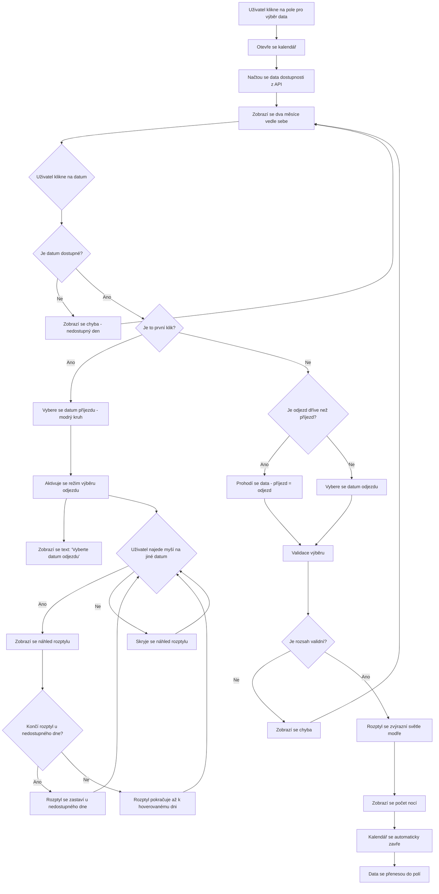
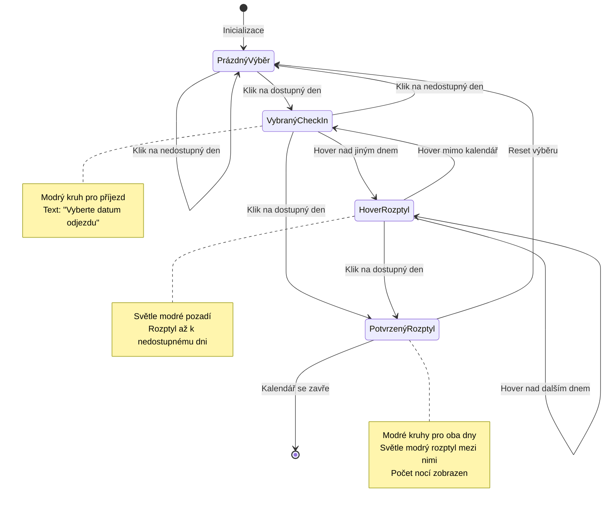
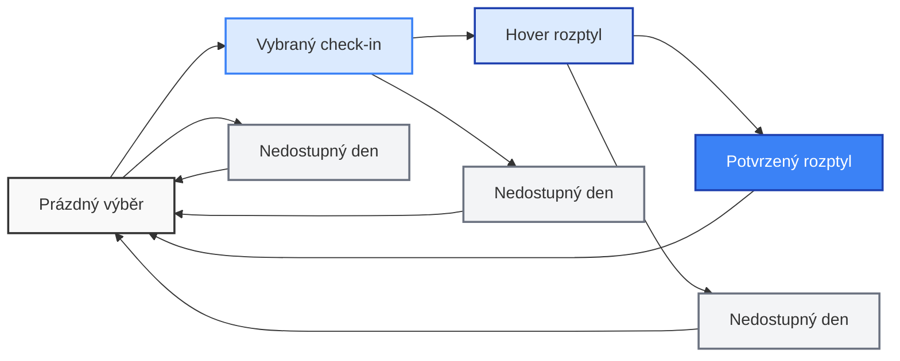
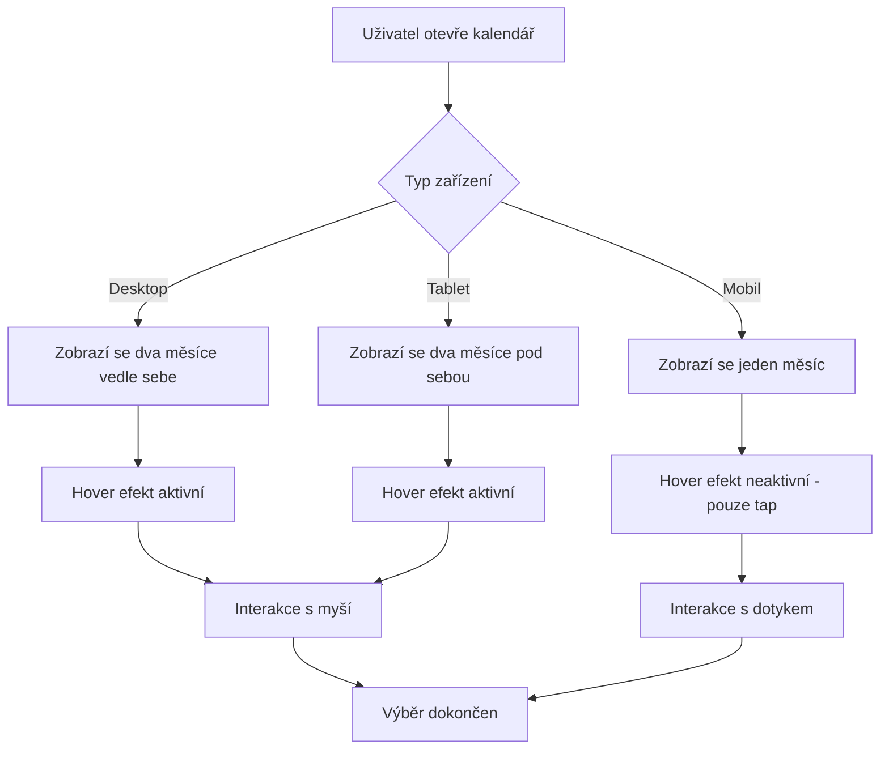
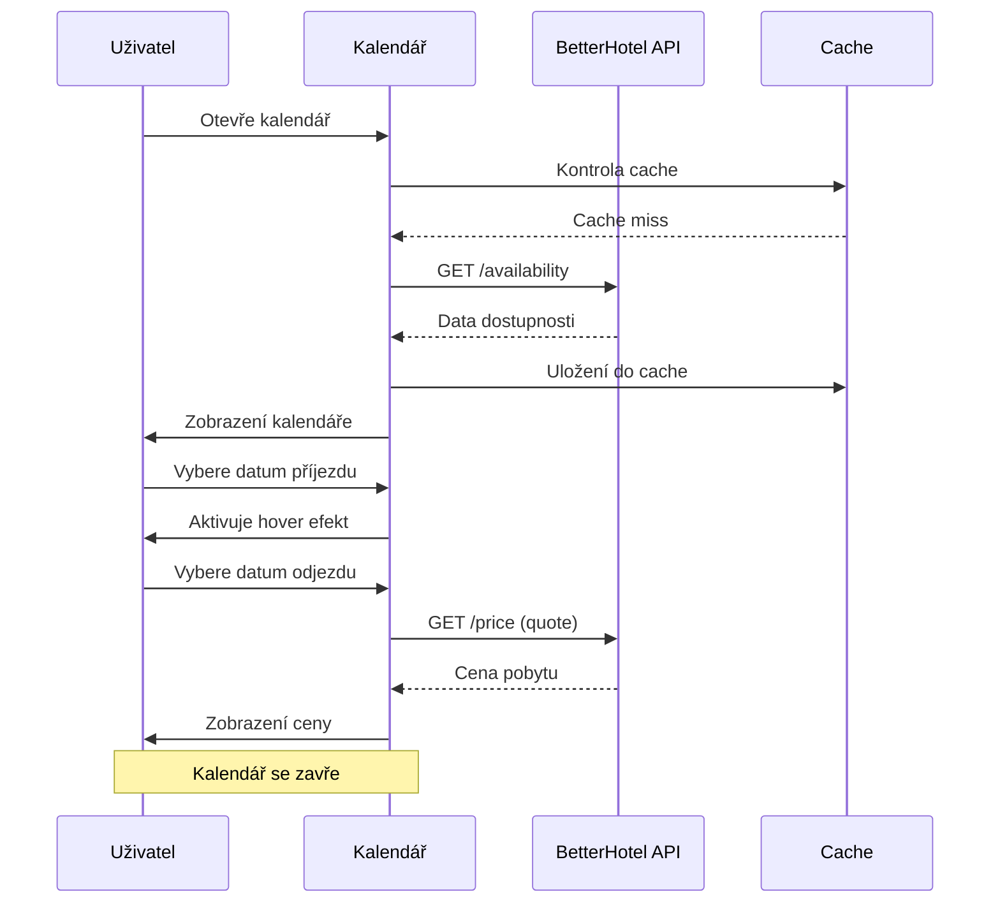
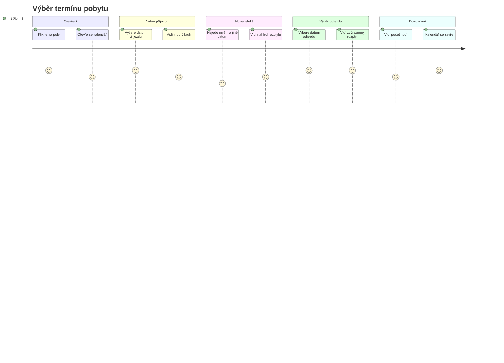
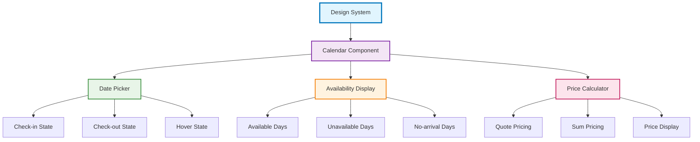

# 🔄 UX Flow Diagrams - BetterHotel Calendar Widget

## 📊 Diagram toku interakce (UX Flow)

## 🔄 Stavový diagram komponenty

## 🎨 Vizuální stavový diagram

## 📱 Responzivní chování

## 🔧 API integrace flow

## 🎯 User Journey Map

## 📋 Checklist implementace podle diagramů

- [x] **Prázdný výběr** - Inicializace kalendáře
- [x] **Vybraný check-in** - Modrý kruh, text "Vyberte odjezd"
- [x] **Hover rozptyl** - Světle modré pozadí, zastavení u nedostupných dnů
- [x] **Potvrzený rozptyl** - Modré kruhy, světle modrý rozptyl, počet nocí
- [x] **Reset výběru** - Kliknutí na nové datum
- [x] **API integrace** - Cache, quote pricing, fallback
- [x] **Responzivní design** - Desktop/tablet/mobil
- [x] **Error handling** - Nedostupné dny, nevalidní rozsah
- [x] **Accessibility** - ARIA, keyboard navigation
- [x] **Localization** - Česká/anglická lokalizace

## 🎨 Design System Integration

---

**Použití diagramů:**
- **UX Flow** - Pro pochopení celkového toku interakce
- **State Diagram** - Pro implementaci stavového stroje
- **Visual State** - Pro design a vizuální konzistenci
- **Responsive** - Pro responzivní implementaci
- **API Integration** - Pro technickou implementaci
- **User Journey** - Pro UX testování a optimalizaci
- **Design System** - Pro integraci do design systému
