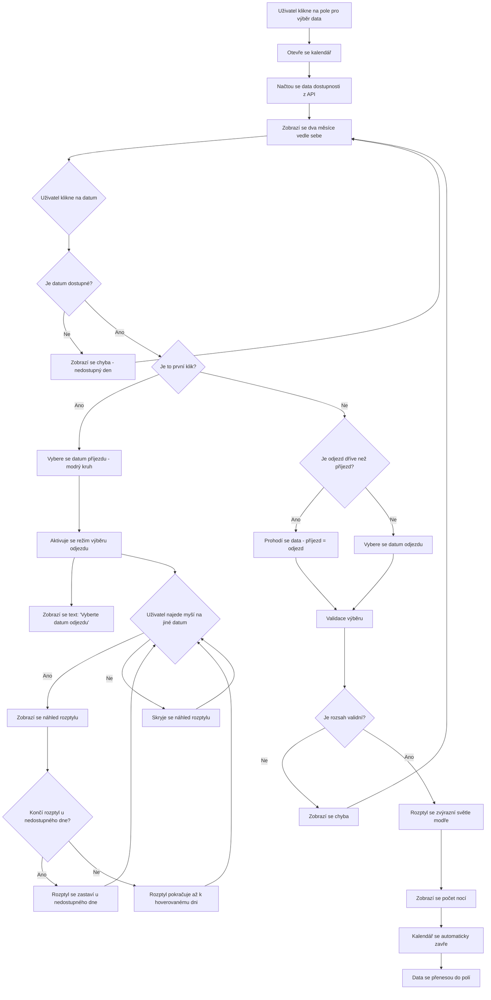
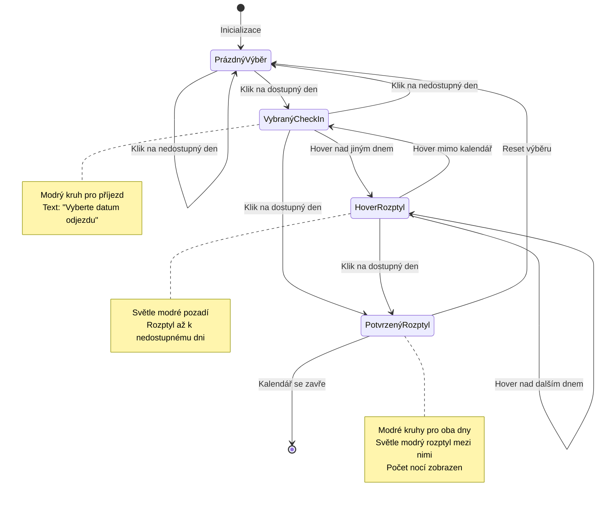

# UX Specifikace - BetterHotel Calendar Widget

## 🎯 Cíl komponenty

Vytvořit embeddable kalendářový widget pro výběr data příjezdu a odjezdu ve stylu Booking.com, který:
- Poskytuje intuitivní UX pro výběr rozsahu pobytu
- Respektuje pravidla dostupnosti z BetterHotel API
- Je plně přístupný a responzivní
- Podporuje lokalizaci

## 🗓️ Funkce kalendáře – výběr data příjezdu a odjezdu

### **Základní princip**

Kalendář umožňuje uživateli vybrat **rozsah pobytu** – tedy **datum příjezdu** (*check-in*) a **datum odjezdu** (*check-out*).
Výběr probíhá interaktivně v jednom kalendářovém widgetu zobrazeném nad vstupním polem.

---

### **Průběh výběru**

#### 1. **První klik – výběr data příjezdu**

* Po kliknutí do pole pro výběr termínu se otevře kalendář se dvěma měsíci vedle sebe (desktop) nebo jedním (mobil).
* Uživatel klikne na požadované datum příjezdu.
* Toto datum se zvýrazní (např. modrým kruhem nebo zvýrazněným pozadím).
* V tu chvíli se automaticky aktivuje režim **výběru data odjezdu**.

#### 2. **Hover efekt – náhled rozptylu**

* Při najetí kurzorem na jiné datum (před potvrzením odjezdu) se zvýrazní **rozptyl dnů** mezi vybraným datem příjezdu a aktuálním datem pod kurzorem.
* Tento rozptyl má obvykle **světlejší barvu pozadí** nebo přechodový gradient, který vizuálně naznačuje délku pobytu.
* Na mobilu se rozptyl zobrazuje při tapnutí až po druhém výběru, ne při hoveru.

#### 3. **Druhý klik – výběr data odjezdu**

* Po kliknutí na druhé datum se rozptyl **potvrdí**.
* Dny mezi příjezdem a odjezdem se **trvale zvýrazní** – obvykle páskem nebo spojeným pozadím.
* Datum odjezdu se rovněž vizuálně zvýrazní (např. stejný styl jako příjezd, ale s jiným odstínem).

#### 4. **Zápis do polí**

* Po potvrzení druhého data se kalendář automaticky zavře.
* Do políček se vyplní vybraná data ve formátu např. `12. 10. 2025 – 15. 10. 2025`.

---

### **Interakce a chování**

#### ❌ **Reset výběru**

* Pokud uživatel klikne na jiné datum po dokončení výběru, výběr se resetuje a začne znovu od příjezdu.

#### 🔒 **Nedostupné termíny**

* Nedostupné dny (např. plně obsazené) jsou **neklikatelné** a vizuálně označené (např. šedé, přeškrtnuté nebo se sníženou opacitou).
* Pokud jsou v rozptylu mezi příjezdem a odjezdem nedostupné dny, rozptyl nelze potvrdit – kalendář zůstane ve stavu výběru odjezdu.

#### ⚙️ **Další logika**

* Den odjezdu může být stejný den, kdy někdo jiný přijíždí – tedy **den odjezdu není blokovaný jako obsazený den** (v systému dostupnosti se kontroluje `close_to_arrival` a `close_to_departure`).
* Při výběru rozptylu se respektují pravidla dostupnosti (např. minimální počet nocí).

---

### **Vizuální stavové prvky**

| Stav                 | Popis                                | Příklad stylu                     |
| -------------------- | ------------------------------------ | --------------------------------- |
| **Defaultní den**    | Běžně dostupný den                   | text tmavě šedý                   |
| **Hoverovaný den**   | Náhled rozptylu (při výběru odjezdu) | světlé modré pozadí               |
| **Vybraný příjezd**  | Aktivní první datum                  | modrý kruh, tučné písmo           |
| **Vybraný odjezd**   | Aktivní druhé datum                  | modrý kruh, tučné písmo           |
| **Rozptyl mezi dny** | Dny mezi příjezdem a odjezdem        | světlé modré pozadí               |
| **Nedostupný den**   | Není možné vybrat                    | šedý, neklikací                   |
| **Dnešní datum**     | Zvýraznění pro orientaci             | modrý rámeček                     |

---

### **Příklad chování (Booking.com-like):**

1. Klikneš na 12. října → označí se jako příjezd.
2. Najedeš na 15. října → 13. a 14. se zobrazí světle zvýrazněné.
3. Klikneš na 15. října → potvrzeno, rozptyl 12.–15. října je zvýrazněn.
4. Kalendář se zavře a data se propíšou do polí.

---

## 🏡 Výběr termínu pobytu (Check-in / Check-out)

### **1. Základní princip**

Komponenta pro výběr termínu pobytu umožňuje uživateli jednoduše určit:

* **datum příjezdu (check-in)**
* **datum odjezdu (check-out)**

Obě hodnoty se vybírají v jednom sdíleném kalendářovém rozhraní.
Cílem je minimalizovat počet kroků, předejít chybám a vizuálně jasně vyznačit aktuální stav výběru.

### **2. Logika interakce krok za krokem**

#### **Krok 1 – Otevření kalendáře**

* Kliknutím do pole pro výběr data (nebo do obou – podle implementace) se otevře kalendář.
* Pokud je kalendář napojen na API dostupnosti, přednačítá si informace o dostupných/obsazených dnech.
* Zobrazí se obvykle dva měsíce vedle sebe (desktop), jeden měsíc (mobil).

#### **Krok 2 – Výběr data příjezdu (Check-in)**

* Uživatel klikne na požadované datum příjezdu.
* Toto datum se zvýrazní (např. plná barva pozadí nebo modrý kruh).
* Stav komponenty se přepne do režimu **výběru data odjezdu (Check-out)**.
* Pomocí tooltipu nebo drobného textu pod kalendářem může být uživatel naveden:
  *„Vyberte datum odjezdu".*

#### **Krok 3 – Náhled rozptylu při hoveru**

* Při pohybu myší nad jinými daty se zobrazí **náhled pobytu** – světle zvýrazněné dny mezi check-inem a aktuálním dnem pod kurzorem.
* Tento hover efekt pomáhá uživateli vizuálně odhadnout délku pobytu.
* Nedostupné dny (např. obsazené) ukončí rozptyl – nelze přes ně přejít.
* Na mobilu se tento krok přeskakuje (bez hoveru).

#### **Krok 4 – Výběr data odjezdu (Check-out)**

* Druhým kliknutím uživatel potvrdí datum odjezdu.
* Rozptyl dnů mezi příjezdem a odjezdem se **trvale zvýrazní**.
* Obě data se zobrazí jako **aktivní krajní body výběru** – např. kruhy nebo tečky s kontrastním pozadím.

#### **Krok 5 – Automatické uzavření kalendáře**

* Po potvrzení obou dat se kalendář **automaticky zavře**.
* Vybraná data se přenesou do polí (formát např. `12.–15. října 2025`).
* Uživatel může výběr upravit kliknutím na pole – výběr se znovu otevře a lze ho přepsat.

### **3. Chování a stavy**

| Stav                       | Popis                                      | Příklad                                                |
| -------------------------- | ------------------------------------------ | ------------------------------------------------------ |
| **Prázdný výběr**          | Žádné datum zatím vybráno                  | Pole placeholder „Vyberte termín"                      |
| **Vybraný check-in**       | První klik potvrzen, čeká se na check-out  | Datum zvýrazněno, text pod kalendářem „Vyberte odjezd" |
| **Hover rozptyl**          | Mezi check-inem a kurzorem                 | Světlejší pás mezi dny                                 |
| **Potvrzený rozptyl**      | Check-in + check-out vybrány               | Dny mezi nimi zvýrazněné                               |
| **Nedostupné dny**         | Není možné vybrat                          | Šedý text, kurzor „not-allowed"                        |
| **Minimální délka pobytu** | Nelze potvrdit kratší rozptyl              | Tooltip např. „Minimální délka pobytu 2 noci"          |
| **Reset výběru**           | Kliknutí na jiné datum po dokončení výběru | Předchozí výběr se smaže, začíná znovu od check-inu    |

### **4. Napojení na API dostupnosti (volitelné)**

* Při načtení kalendáře systém označí dny s `availability = false` jako **disabled**.
* Dny označené `close_to_arrival = true` nebo `close_to_departure = true` omezují možné kombinace výběru.
* V den **odjezdu** může být nový příjezd jiného hosta – kalendář proto den odjezdu **nezakrývá** jako obsazený.

### **5. Validace a chybové stavy**

* Pokud uživatel vybere odjezd dříve než příjezd → výběr se resetuje a začne znovu.
* Pokud mezi daty existuje nedostupný den → zobrazí se hláška např.
  *„Zvolený rozsah obsahuje nedostupné dny."*
* Po výběru se automaticky spočítá počet nocí (např. `3 noci`) a může se zobrazit pod kalendářem nebo v rekapitulaci.

### **6. Vizuální konzistence (Booking.com inspirace)**

* **Check-in** → modrý nebo zvýrazněný kruh
* **Check-out** → stejný styl, jiný odstín nebo ikona „odchod"
* **Rozptyl** → světle modrá výplň mezi nimi
* **Hover** → mírně tmavší přechod
* **Disabled dny** → šedé, neklikací
* **Dnešní den** → tenký rámeček

### **7. Mikrokopie / textové stavy**

| Kontext               | Text                               |
| --------------------- | ---------------------------------- |
| Před výběrem          | „Vyberte datum příjezdu a odjezdu" |
| Po výběru prvního dne | „Vyberte datum odjezdu"            |
| Při nevalidním výběru | „Vybraný termín není dostupný"     |
| Po potvrzení výběru   | „3 noci, 12.–15. října 2025"       |

---

## 🔄 Diagram toku interakce (UX Flow)



### **Stavový diagram komponenty**



---

## 🔧 Technické požadavky

### **API integrace**
- BetterHotel public API (žádné tajné klíče)
- Endpointy: `/availability` a `/price`
- Defenzivní mapování všech polí z API
- Cache s konfigurovatelným TTL

### **Validace**
- Turn-over pravidlo: check-in kontroluje dostupnost, check-out ne
- Close-to-arrival: start den s `close_to_arrival: true` je zakázaný
- Rozsah validace: nelze vybrat rozsah přes nedostupné dny
- Minimální/maximální počet nocí

### **Přístupnost**
- ARIA labely pro všechny interaktivní prvky
- Keyboard navigation (šipky, Enter, Space)
- Focus management
- Screen reader podpora

### **Responzivita**
- Desktop: dvouměsíční zobrazení vedle sebe
- Mobil: jednoměsíční zobrazení pod sebou
- Flexibilní grid layout
- Touch-friendly velikosti tlačítek

### **Lokalizace**
- Česká a anglická lokalizace
- Formátování dat podle locale
- Formátování cen podle locale
- Přeložitelné texty v jednom objektu

---

## 🎨 Design systém

### **Barevné schéma**
```css
/* Základní barvy */
--bhc-primary: #3b82f6;      /* Modrá pro hover a aktivní stavy */
--bhc-success: #10b981;       /* Zelená pro vybrané dny */
--bhc-danger: #dc2626;        /* Červená pro nedostupné dny */
--bhc-gray: #6b7280;          /* Šedá pro neaktivní dny */
--bhc-text: #374151;          /* Tmavě šedá pro text */
```

### **Typografie**
- Font: System font stack (-apple-system, BlinkMacSystemFont, 'Segoe UI', Roboto)
- Velikosti: 12px (weekdays), 13px (days), 14px (base), 16px (headers)
- Váhy: 400 (normal), 500 (medium), 600 (semibold), 700 (bold)

### **Spacing**
- Padding: 12px (container), 8px (days), 16px (headers)
- Gap: 1px (grid), 15px (months), 8px (buttons)
- Border radius: 4px (days), 8px (container)

---

## 📱 Responzivní breakpointy

```css
/* Desktop */
@media (min-width: 769px) {
  .bhc-month-grid { flex-direction: row; }
}

/* Tablet */
@media (max-width: 768px) {
  .bhc-month-grid { flex-direction: column; }
}

/* Mobil */
@media (max-width: 480px) {
  .bhc-widget { max-width: 100%; border-radius: 0; }
  .bhc-controls { flex-direction: column; }
}
```

---

## 🧪 Testovací scénáře

### **Základní funkčnost**
1. Výběr rozsahu přes hranici měsíce
2. Start na dni s `close_to_arrival: true` → chyba
3. Quote API selže → fallback na sum_nightly
4. Pobyt 1 noc (minNights=1) i delší
5. Lokalizace ceny (CZK / EUR)

### **Edge cases**
1. Výběr rozsahu přes nedostupné dny
2. Hover efekt končí u nedostupného dne
3. Reset výběru při kliknutí na nové datum
4. Keyboard navigation
5. Screen reader kompatibilita

### **Performance**
1. Cache dostupnosti funguje správně
2. API volání jsou optimalizovaná
3. Renderování je plynulé
4. Memory leaks neexistují

---

## 📋 Checklist implementace

- [x] Dvouměsíční zobrazení
- [x] Hover efekt pouze po check-in
- [x] Automatické zastavení u nedostupných dnů
- [x] Validace rozsahu
- [x] Turn-over pravidlo
- [x] Reset výběru
- [x] Vizuální stavy
- [x] Responzivní design
- [x] Přístupnost
- [x] Lokalizace
- [x] API integrace
- [x] Cache
- [x] Error handling
- [x] Dark mode
- [x] UTC časové zóny
